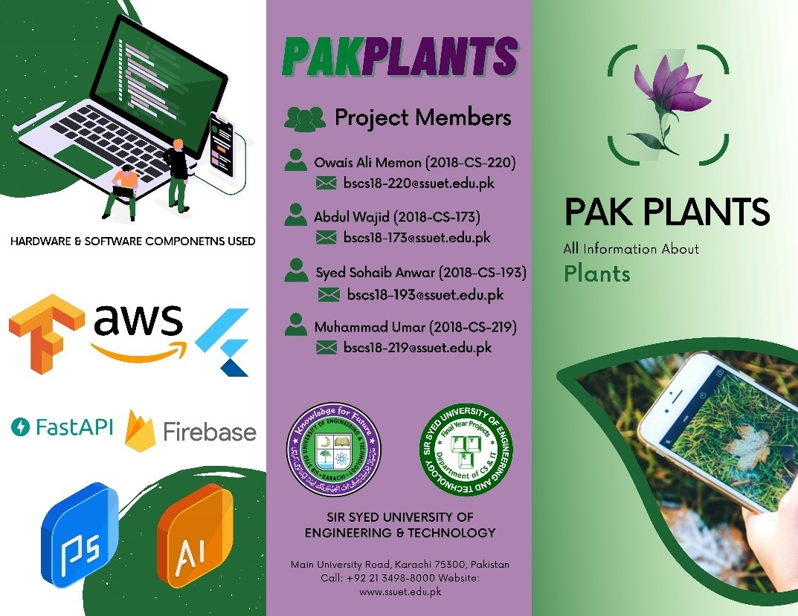

<div align="center">
	<br>
	<a href="header.svg">
		
	</a>
	<br>
</div>
<br>


# Final Year Project: PAKPLANTS

**This repository contain all the backend of project PAKPLANTS**

**PAKPLANTS  is a mobile application that allow user to to identify plants only using images of thier respective leaves by uploading or capturing at real time**
**It also allow user to identify plantation area left in an satellite images uploaded by user. Finally, offer an e-commerce store integrated inside the application.**

PAKPLANTS is based on deep learning and image processing techonology!





## Built With

- Flutter
- tenserflow
- Keras
- AWS
- FASTAPI
- OpenCV


## Live Demo

[Live Demo Link](https://abdulwajid99.github.io/SaylaniWeb/)

## Front-end Link

[Front-end Link](https://github.com/owaisalimemon/pakplants_fyp.git)


## Getting Started

**This is an example of how you may give instructions on setting up your project locally.**
**Modify this file to match your project, remove sections that don't apply. For example: delete the testing section if the currect project doesn't require testing.**


To get a local copy up and running follow these simple example steps.

### Prerequisites

## Setup

If you installed git you can clone the code to your machine, or download a ZIP of all the files directly.

Run the following [git](https://git-scm.com/downloads) command to clone the files to your machine:

```bash
git clone https://github.com/AbdulWajid99/PAKPLANTS_Webapp.git
```

- Once the files are on your machine, open the _html-css-javascript-getting-started_ folder in [Visual Studio Code](https://code.visualstudio.com/).

- With the files open in Visual Studio Code, press the **Go Live** button at the bottom of the window to launch the files with [Live Server](https://marketplace.visualstudio.com/items?itemName=ritwickdey.LiveServer).


## Authors


👤 **Author1** GitHub: [@githubhandle](https://github.com/AbdulWajid99))

👤 **Author2** GitHub: [@githubhandle](https://github.com/walikhan226))

👤 **Author3** GitHub: [@githubhandle](https://github.com/Sohaib1497))

👤 **Author4** GitHub: [@githubhandle](https://github.com/owaisalimemon))


## 🤝 Contributing

Contributions, issues, and feature requests are welcome!

Feel free to check the [issues page](../../issues/).

## Show your support

Give a ⭐️ if you like this project!

## Acknowledgments

- Hat tip to anyone whose code was used
- Inspiration
- etc

## 📝 License

This project is [MIT](./MIT.md) licensed.

